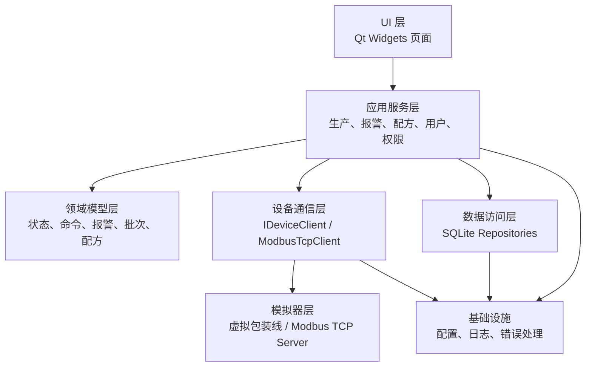

# 总体设计

## 1. 文档信息

| 项目 | 内容 |
| --- | --- |
| 文档版本 | v0.1 |
| 创建日期 | 2026-05-30 |
| 适用阶段 | 总体设计 |
| 目标读者 | 上位机开发者、测试者、后续实现者 |

## 2. 设计目标

本设计把需求分析和产线模型转成可实现的软件结构。后续 Qt/CMake 工程骨架应按本文组织模块、接口、数据流和测试策略。

目标：

- 使用 C++20、Qt 6.10.2 Widgets、CMake 构建 Windows 桌面上位机。
- 支持全自动小型瓶装包装线的监控、控制、报警、批次、配方、用户和数据记录。
- 无真实 PLC 时，优先通过本机 Modbus TCP 模拟链路完成协议学习和联调。
- UI、业务逻辑、通信、模拟器、数据库之间保持清晰边界，避免界面代码直接读写点位或数据库。

当前阶段不创建代码骨架，不实现业务代码。

## 3. 环境与技术选型

| 方向 | 选型 | 说明 |
| --- | --- | --- |
| 语言 | C++20 | 使用现代 C++ 基础能力，避免过度模板化 |
| UI | Qt Widgets | 适合传统工控界面、表格、参数页和对话框 |
| 构建 | CMake | 后续生成 Qt/C++ 工程骨架 |
| 编译器 | MinGW 64-bit | 匹配本机 Qt 6.10.2 MinGW |
| 通信 MVP | Qt Network + Modbus TCP 最小实现 | 当前 Qt 安装未检测到 QtSerialBus/QtSerialPort |
| 数据库 | SQLite + QtSql | 本机已检测到 QtSql，适合单机数据记录 |
| 曲线 | Qt Charts | 本机已检测到 QtCharts |
| 配置 | QSettings/INI | 适合 Windows 单机配置 |
| 日志 | Qt 日志系统，后续可替换 spdlog | 先降低依赖复杂度 |

通信扩展策略：

| 阶段 | 协议 | 实现方式 |
| --- | --- | --- |
| MVP | Modbus TCP | 使用 Qt Network 实现最小客户端和模拟服务端 |
| 后续 | 串口、Modbus RTU | 补齐 QtSerialPort 或引入其他串口库后实现 |
| 后续 | OPC UA | 通过 open62541 或 Qt OPC UA 环境实现 |
| 后续 | Snap7/S7 | 通过 Snap7 适配器实现 |

## 4. 总体架构

系统采用分层模块设计：



核心原则：

- UI 只展示状态和发起用户操作，不直接处理 PLC 点位细节。
- 应用服务层负责权限判断、用例编排、日志记录和数据持久化。
- 设备通信层用统一接口屏蔽模拟器、Modbus TCP 和后续真实 PLC 差异。
- 模拟器按真实 PLC 思路维护点位、状态机和报警。
- 数据库只通过 Repository 访问，不在页面里直接写 SQL。

## 5. 模块划分

| 模块 | 职责 |
| --- | --- |
| UI 模块 | 主窗口、顶部状态栏、左侧导航、主监控、工位详情、报警、配方、趋势、设置、用户、模拟器页面 |
| 应用服务模块 | 启动、停止、复位、报警确认、批次开始/结束、配方下发、用户切换 |
| 领域模型模块 | 系统状态、工位状态、报警生命周期、配方、批次、用户、操作日志 |
| 通信模块 | 连接管理、轮询、命令写入、参数写入、点位映射、断线重连 |
| 模拟器模块 | 虚拟 PLC 点位表、产线状态机、故障注入、产量和质量模拟 |
| 数据模块 | SQLite 初始化、用户、配方、批次、报警、日志、趋势数据访问 |
| 权限模块 | 当前用户会话、角色权限、页面访问、按钮可用性 |
| 基础设施模块 | 配置、日志、时间、错误码、统一结果类型 |

## 6. 运行时结构

MVP 采用单进程桌面应用，内部同时运行上位机和模拟器：

```text
Qt 桌面进程
  UI Thread
    MainWindow / Pages
  Device Worker Thread
    ModbusTcpClient
    Polling Timer
  Simulator Worker Thread
    ModbusTcpServer
    LineSimulator
  Database Worker Thread
    SQLite Repositories
```

线程规则：

- UI 线程只更新界面，不执行长耗时通信或数据库写入。
- 通信线程负责连接、轮询、命令下发和重连。
- 模拟器线程负责虚拟产线节拍、点位变化和故障注入。
- 数据库线程负责写报警、操作日志、批次和趋势数据。
- 跨线程通过 Qt signal/slot queued connection 传递快照、命令结果和错误。

后续接真实设备时，可以关闭内置模拟器，只保留 `IDeviceClient` 连接真实 PLC 或外部模拟器。

## 7. 核心接口设计

### 7.1 设备通信接口

后续代码中定义统一设备接口，UI 和业务层不依赖具体协议。

```cpp
enum class DeviceCommand {
    Start,
    Stop,
    Reset,
    AlarmAck,
    ModeAuto,
    ModeManual,
    BatchStart,
    BatchEnd,
    RejectTest,
    SimFault
};

struct DeviceSnapshot {
    SystemState systemState;
    RunMode currentMode;
    int currentAlarmCode;
    int activeStation;
    ProductionCounters counters;
    ProcessValues processValues;
    StationInputs stationInputs;
};

class IDeviceClient : public QObject {
    Q_OBJECT
public slots:
    virtual void connectToDevice(const DeviceConnectionConfig& config) = 0;
    virtual void disconnectFromDevice() = 0;
    virtual void sendCommand(DeviceCommand command) = 0;
    virtual void writeRecipe(const RecipeParameters& recipe) = 0;

signals:
    void connectionChanged(ConnectionState state);
    void snapshotUpdated(DeviceSnapshot snapshot);
    void commandFinished(DeviceCommand command, bool ok, QString message);
    void errorOccurred(DeviceError error);
};
```

MVP 实现：

- `ModbusTcpClient`：使用 Qt Network 读写 Modbus TCP 点位。
- `SimulatedModbusServer`：在本机监听默认端口，提供虚拟 PLC 点位。
- 最小功能码：读线圈、读离散输入、读保持寄存器、读输入寄存器、写单线圈、写单寄存器、写多寄存器。

### 7.2 应用服务

| 服务 | 职责 |
| --- | --- |
| `LineControlService` | 启动、停止、复位、模式切换、控制命令前置条件检查 |
| `AlarmService` | 当前报警、报警确认、报警生命周期、报警入库 |
| `RecipeService` | 配方增删改查、参数校验、配方下发 |
| `BatchService` | 批次开始、结束、产量汇总、生产记录 |
| `UserSessionService` | 登录、退出、切换用户、当前角色 |
| `PermissionService` | 页面和按钮权限判断 |
| `TrendService` | 过程数据缓存、趋势刷新、历史趋势查询 |

应用服务必须记录关键操作日志：

```text
登录、退出、切换用户、启动、停止、复位、报警确认、配方修改、配方下发、批次开始、批次结束、系统设置修改
```

## 8. 数据流设计

### 8.1 状态刷新

```text
通信线程定时轮询点位
  -> 生成 DeviceSnapshot
  -> 应用服务更新内存状态
  -> UI 刷新顶部状态栏、主监控、工位详情、趋势
  -> 报警服务识别报警变化并写入数据库
```

默认轮询周期：

| 数据 | 周期 |
| --- | --- |
| 安全和系统状态 | 500 ms |
| 产量和过程数据 | 1000 ms |
| 趋势采样 | 1000 ms |
| 历史查询 | 用户触发 |

### 8.2 控制命令

```text
用户点击按钮
  -> UI 调用应用服务
  -> 权限检查
  -> 前置条件检查
  -> 发送 DeviceCommand
  -> 通信层写对应 Coil
  -> 等待状态轮询确认结果
  -> 写操作日志
  -> UI 显示成功或失败原因
```

### 8.3 报警处理

```text
轮询发现当前报警码变化
  -> AlarmService 创建或更新报警记录
  -> UI 当前报警栏提示
  -> 用户点击报警确认
  -> 写 CMD_ALARM_ACK
  -> 写确认人和确认时间
  -> 报警恢复且已确认后关闭
```

报警状态：

```text
ActiveUnacked -> ActiveAcked -> Closed
ActiveUnacked -> ClearedUnacked -> Closed
```

### 8.4 用户切换

```text
用户点击切换用户
  -> 选择最近用户或启用用户
  -> 输入密码或 PIN
  -> 认证通过
  -> 更新当前会话
  -> 刷新页面和按钮权限
  -> 记录旧用户退出和新用户登录日志
```

用户列表可以保存，密码只保存哈希，不保存明文。

## 9. 数据库设计初版

SQLite 数据库用于单机追溯和学习。MVP 表结构按以下对象设计，后续详细设计再确定字段类型和索引。

| 表 | 主要字段 | 用途 |
| --- | --- | --- |
| `users` | id、login_name、display_name、role、enabled、password_hash、last_login_at | 用户和快速切换 |
| `recipes` | id、name、target_speed、fill_volume、fill_time、capping_torque、weight_min、weight_max、label_mode、target_count、quality_rate | 配方管理 |
| `batches` | id、batch_no、recipe_id、operator_id、start_time、end_time、target_count、total_count、good_count、bad_count、status | 生产批次 |
| `alarms` | id、alarm_code、alarm_name、station、level、state、triggered_at、acked_at、acked_by、cleared_at、closed_at | 报警追溯 |
| `operation_logs` | id、user_id、login_name、display_name、role、action、target、result、message、created_at | 操作审计 |
| `trend_samples` | id、sample_time、speed、fill_volume、weight、torque、temperature、pressure | 趋势曲线 |
| `system_config` | key、value、updated_at | 可持久化系统配置 |

运行路径建议：

```text
data/app.sqlite3
logs/app-yyyyMMdd.log
config/app.ini
```

这些运行数据不提交到 Git；后续只提交 `config/app.example.ini`。

## 10. UI 总体设计

主窗口布局：

```text
顶部状态栏
左侧导航菜单
中央页面区域
底部当前报警栏
```

页面优先级：

| 优先级 | 页面 | 说明 |
| --- | --- | --- |
| P0 | 主监控 | MVP 必做，显示流程、状态、产量、控制按钮 |
| P0 | 报警记录 | MVP 必做，显示当前报警和历史报警 |
| P0 | 参数/配方 | MVP 必做，配置并下发基本生产参数 |
| P0 | 模拟器 | MVP 必做，触发正常和异常流程 |
| P1 | 工位详情 | 展示每个工位输入、输出、状态 |
| P1 | 生产记录 | 查询批次和产量 |
| P1 | 趋势曲线 | 显示过程数据曲线 |
| P1 | 用户权限 | 登录、切换用户、用户管理 |
| P2 | 手动控制 | 工程师调试页面 |
| P2 | 系统设置 | 通信、数据库、日志配置 |

权限刷新规则：

- 当前用户变化后，立即刷新导航可见性和按钮可用性。
- 操作员可执行启动、停止、复位、报警确认、查看记录。
- 工程师可修改配方、使用模拟器、进入手动控制。
- 管理员可管理用户和系统设置。

## 11. 错误处理与安全边界

| 场景 | 处理 |
| --- | --- |
| 通信断开 | 顶部状态显示断开，禁用启动和参数下发，保留停止提示 |
| 命令超时 | 命令失败提示，记录操作日志 |
| 当前有报警 | 禁止启动，提示先处理报警 |
| 急停触发 | 显示急停状态，系统进入急停或报警状态 |
| 数据库不可用 | 提示数据记录异常，核心控制不依赖数据库继续运行 |
| 权限不足 | 按钮禁用或操作拒绝，记录日志 |
| 模拟器未启动 | 显示未连接，允许用户从模拟器页面启动 |

软件停止按钮只表示正常停机。真实急停必须由硬件急停按钮和安全回路实现，上位机只显示和记录急停状态。

## 12. 后续目录结构建议

下一阶段创建代码骨架时，建议使用以下结构：

```text
D:\C1\upkun
  CMakeLists.txt
  README.md
  docs/
  config/
    app.example.ini
  src/
    app/
      main.cpp
      MainWindow.h
      MainWindow.cpp
    ui/
      pages/
      widgets/
    domain/
      DeviceTypes.h
      AlarmTypes.h
      Recipe.h
      User.h
    services/
      LineControlService.h
      AlarmService.h
      RecipeService.h
      BatchService.h
      UserSessionService.h
    device/
      IDeviceClient.h
      ModbusTcpClient.h
      ModbusPointMap.h
    simulator/
      LineSimulator.h
      SimulatedModbusServer.h
    storage/
      DatabaseManager.h
      UserRepository.h
      RecipeRepository.h
      AlarmRepository.h
    infrastructure/
      AppConfig.h
      Logger.h
      Result.h
  tests/
    unit/
    integration/
```

命名原则：

- 页面类以 `Page` 结尾，例如 `MonitorPage`、`AlarmPage`。
- 服务类以 `Service` 结尾。
- 数据访问类以 `Repository` 结尾。
- 协议适配类以具体协议命名，例如 `ModbusTcpClient`。
- UI 不直接包含 SQL、Modbus 地址或模拟器状态机逻辑。

## 13. 测试策略

| 类型 | 覆盖内容 |
| --- | --- |
| 单元测试 | 报警生命周期、权限判断、配方参数校验、点位映射 |
| 集成测试 | Modbus TCP 客户端与模拟服务端读写、断线重连、命令响应 |
| 数据库测试 | 用户、配方、批次、报警、操作日志的增删改查 |
| UI 手工测试 | 登录、切换用户、启动、停止、复位、报警确认、配方下发 |
| 回归测试 | 每个里程碑结束后验证主监控、报警、配方和模拟器核心流程 |

MVP 验收场景：

```text
启动模拟器 -> 登录操作员 -> 选择配方 -> 开始批次 -> 自动模式 -> 启动 -> 产量增长
触发缺盖报警 -> 当前报警显示 -> 报警确认 -> 清除故障 -> 复位 -> 再次启动
切换工程师用户 -> 修改配方 -> 下发参数 -> 操作日志可查询
```

## 14. 下一阶段任务

总体设计完成后，下一阶段进入 Qt/CMake 工程骨架：

1. 创建 CMake 项目和 Qt Widgets 最小主窗口。
2. 建立 `src/`、`tests/`、`config/` 目录。
3. 接入 QtSql、QtCharts、QtNetwork。
4. 创建基础领域类型和服务接口空实现。
5. 创建模拟器页面占位和主监控页面占位。
6. 配置一次可构建、可运行、可提交的最小版本。
